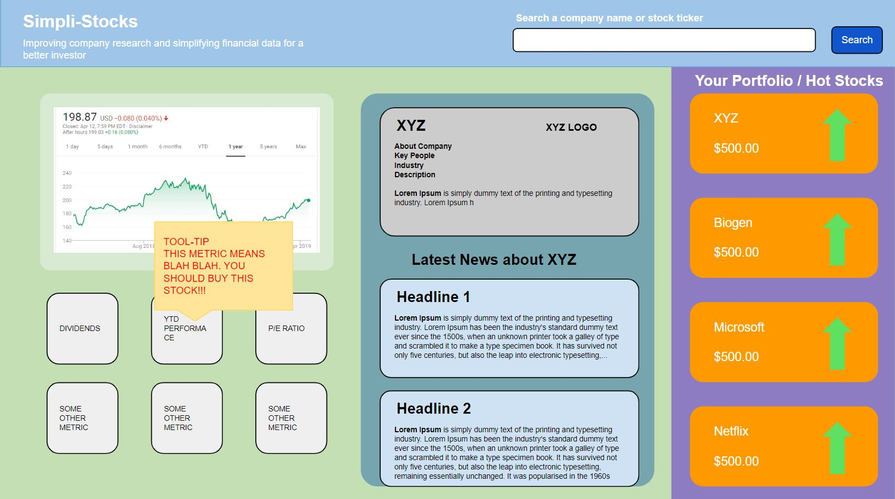
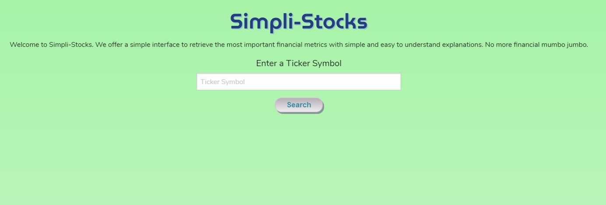
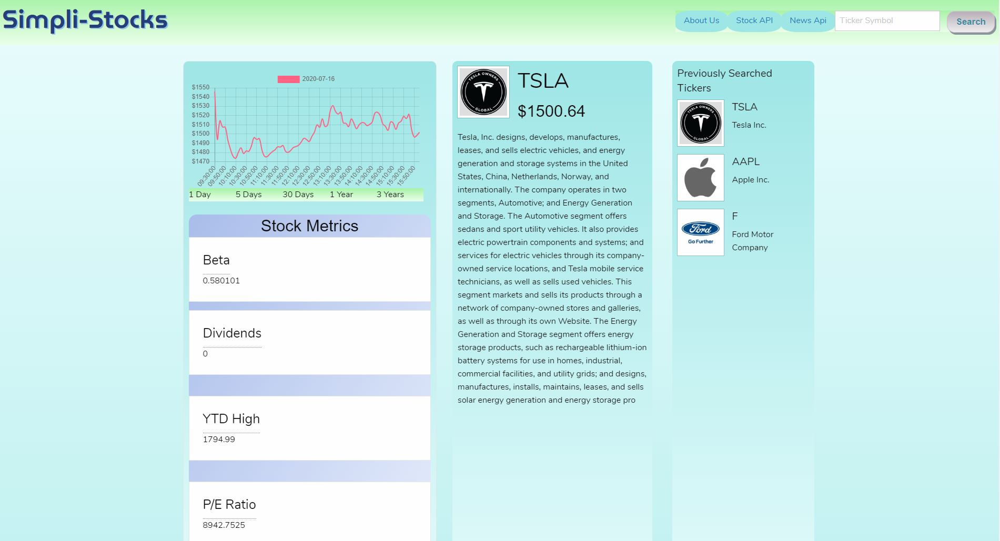
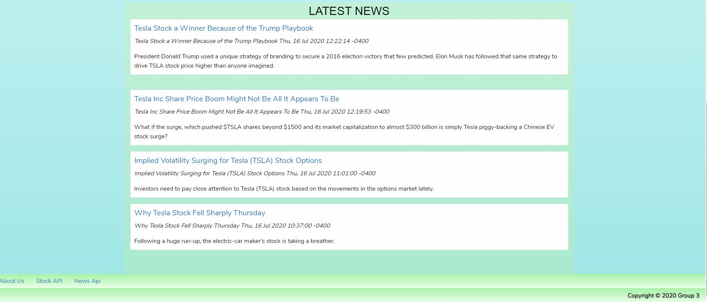

# $impli-Stocks

## Product Description:

Our goal is to provide an easy to use platform for researching an investment opportunity's financial data and news stories. The main differentiator between our product and existing outlets is they are not easy to understand or navigate. Our platform is user friendly for people who are not savvy with complex financial knowledge.

## User Story:
As a new investor, 

I want to see stock options 

so that I can make profitable decisions.

I want to learn about stock metrics

so that I can make informed choices.

## Acceptance Criteria:
Given I am a new investor,

When I search a ticker symbol for a company, 

Then I expect the company name, bio, price, and financial ratios to populate. 

When I search another ticker symbol for a company,

Then I expect my previous searches to show.

## Goals:

### Phase 1: Necessary

1. Build the html grid & css for styling.
2. Return a working AJAX request for financial data.
3. Add in easy to understand definitions for financial terms via tootip.

### Phase 2: Necessary

4. Return and display financial news.
5. Return and display company logo.
6. Display YTD performance metrics vs S&P500 ytd metric. (API STRICTLY FOR THIS)

#### Group members

- Patrick Wells
- Elizabeth Lee
- Sarah Abouelela
- Michael Chen

[Financial Modeling API](https://financialmodelingprep.com/developer/docs/)

[Stock News API](https://stocknewsapi.com/)

